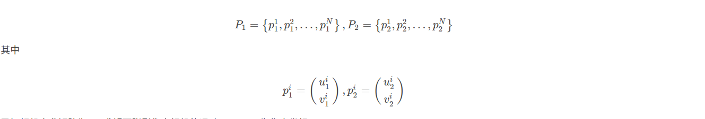
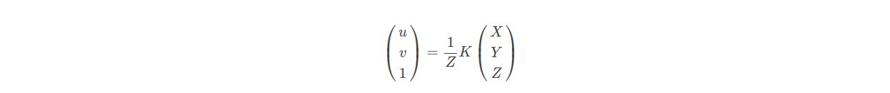
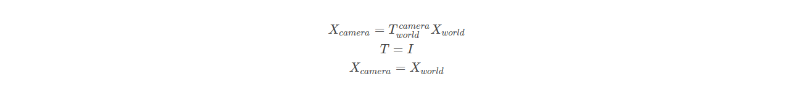
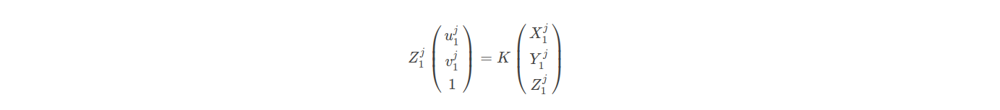
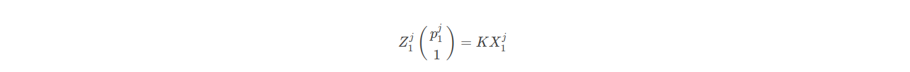
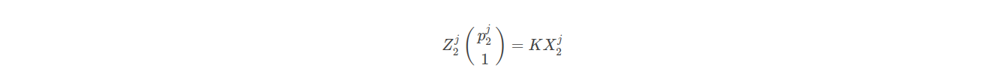
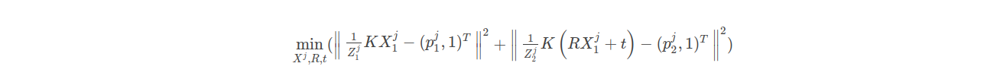
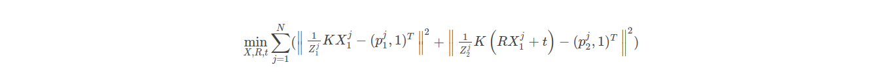
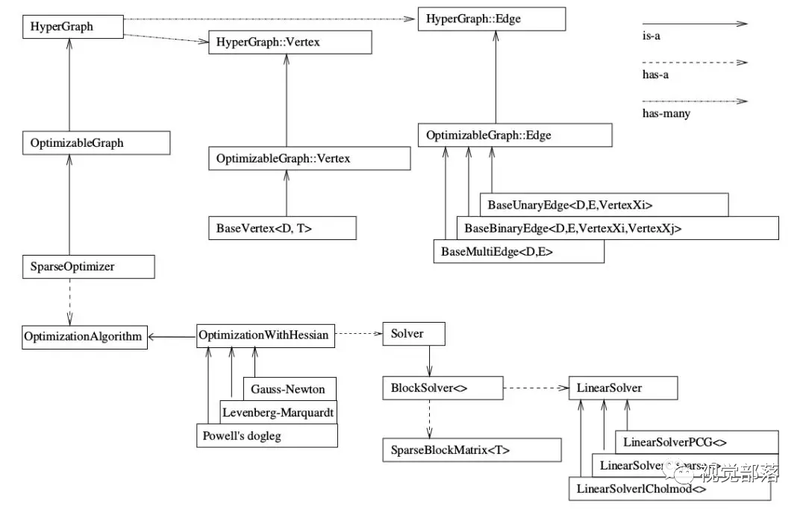

# 光束平差法
    这是一个BA的测试样例， 包含了通过C++和g2o实现的BA算法，意在通过优化的方法，提高数据精度与鲁棒性。
    BA是指从视觉图像中提炼出最优的3D模型和相机参数（内外参)。
    实际上将Bundle Adjustment称作光束平差是不严谨的，这更像一种出于历史原因的叫法。

## 样例说明
    文件夹的命名格式与ros接近， 如下
    --build: 编译好的库文件与参数文件
    --config: 参数文件， 用于参变分离
    --data： 用于计算光束平差的数据
    --document: 用于存放相关文档
    --include: 用于存放工程头文件
    --src: 用于存放工程的源代码
    --test: 用于存放测试代码
    CMakeLists.txt: 用于链接编译

    本项目依赖openCV4.2.0, g2o任意版本

## 理论证明
    那么出于相关资料的采集， 对于这样双目的问题，我认为图优化的解法是优于传统的光束平差的解法的， 
    并且核心的算法模块已经在g2o中封装完成，开发起来相对而言更轻松，因此此处给出了，基于特征点的双视图的光束平差的解法，可能存在问题，麻烦指正。
    在图像img1与img2之间， 存在N对通过特征匹配产生的同名点，如下：

    已知相机内参矩阵为K，求解两张影像中相机的运动R,t。u、v为像素坐标。假设某个特征点j在真实世界坐标系下的坐标为Xj,
    在两幅影像的像素坐标系下分别为pj1,pj2。 我们要找的是真实坐标与像素坐标间的联系。 根据前面的知识可以知道，要想由真实坐标转到像素坐标，需要依次经过如下几步：
    真实世界坐标->相机坐标->图像坐标->像素坐标
    由相机坐标转像素坐标在这篇博客小孔成像模型里已经介绍了，这里直接给出公式:

    这里u、v为像素坐标，X、Y、Z为相机坐标系坐标。也就是说我们只需要再找到相机坐标与真实世界坐标间的变换矩阵T，既可以实现由真实坐标转像素坐标的流程了。
    而这个变换矩阵T其实就可以看成是相机此时的位姿。那么这样的话可以理解为真实世界坐标系与左边的相机坐标系重叠，也即真实世界坐标系下的坐标与左相机坐标系下的坐标相等。

    由小孔成像模型可得

    同时对于左相机与右相机均有：

    将八个点带入即可通过对极几何的算法求出， 而在图优化中可以将优化方程写成以下：

    由于各种噪声的存在，投影关系不能完美满足，所以转而优化他们的误差二范数，因此对于每个特征点都能写出一个二范数误差项，并对他们求和：

    即为最小化重投影误差问题，是一个非线性，非凸的问题。误差项是将像素坐标和3D点按照当时估计的位姿进行投影比较得到误差，所以称为重投影误差，在实操中，是给较好的初值来让误差项尽可能的小的。

## 关于g2o

    g2o的系统架构见上，可参考此图，在优化问题中使用g2o。
    图优化的流程为：
            1. 选择你想要的图里的节点与边的类型，确定它们的参数化形式；
            2. 往图里加入实际的节点和边；
            3. 选择初值，开始迭代；
            4. 每一步迭代中，计算对应于当前估计值的雅可比矩阵和海塞矩阵；
            5. 求解稀疏线性方程HkΔx=−bk，得到梯度方向；
            6. 继续用GN或LM进行迭代。如果迭代结束，返回优化值。
    g2o会完成3-6步， 只要配置好参数即可。

## 支持库下载
    openCV安装： 
            sudo apt-get install build-essential libgtk2.0-dev libavcodec-dev libavformat-dev libjpeg-dev libswscale-dev libtiff5-dev
            sudo apt-get install libgtk2.0-dev
            sudo apt-get install pkg-config
            官网下载解压安装包打开
            mkdir build
            cd build
            cmake -D WITH_TBB=ON -D WITH_EIGEN=ON -D OPENCV_GENERATE_PKGCONFIG=ON ..
            cmake -D BUILD_DOCS=ON -D BUILD_TESTS=OFF -D BUILD_PERF_TESTS=OFF -D BUILD_EXAMPLES=OFF ..
            cmake -D WITH_OPENCL=OFF -D WITH_CUDA=OFF -D BUILD_opencv_gpu=OFF -D BUILD_opencv_gpuarithm=OFF -D BUILD_opencv_gpubgsegm=OFF ..
            cmake -D CMAKE_BUILD_TYPE=RELEASE -D CMAKE_INSTALL_PREFIX=/usr/local ..
            sudo make -j8
            sudo make install
            sudo gedit /etc/ld.so.conf 写入  include /usr/local/lib
            sudo ldconfig
            sudo gedit /etc/bash.bashrc 写入 PKG_CONFIG_PATH=$PKG_CONFIG_PATH:/usr/local/lib/pkgconfig 
                                            export PKG_CONFIG_PATH
            source /etc/bash.bashrc
            opencv_version

    g2o安装：
           下载源码， cmake .. 
           make -j8
           sudo make install

## 补充
    本测试样例是王英齐于13/10/2023完成， 25/10/2023 完成数据测试。python例程尚未完成。注意：得到好的优化结果的前提是好的数据， 可通过调整某些数据的方法调整残差。